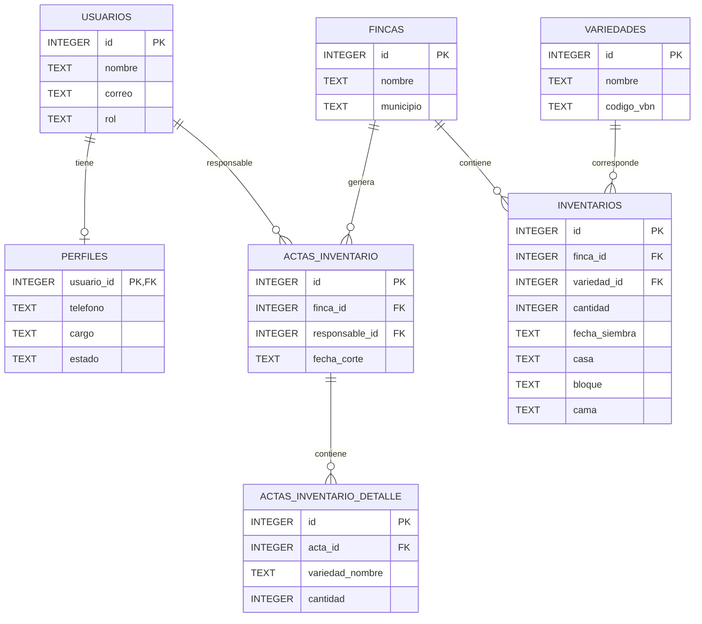

# Diagrama entidad-relación — NIRP International

```mermaid
erDiagram
    USUARIOS ||--o| PERFILES : tiene
    USUARIOS ||--o{ ACTAS_INVENTARIO : responsable
    FINCAS ||--o{ INVENTARIOS : contiene
    VARIEDADES ||--o{ INVENTARIOS : corresponde
    FINCAS ||--o{ ACTAS_INVENTARIO : genera
    ACTAS_INVENTARIO ||--o{ ACTAS_INVENTARIO_DETALLE : contiene

    USUARIOS {
        INTEGER id PK
        TEXT nombre
        TEXT correo
        TEXT rol
    }

    PERFILES {
        INTEGER usuario_id PK,FK
        TEXT telefono
        TEXT cargo
        TEXT estado
    }

    FINCAS {
        INTEGER id PK
        TEXT nombre
        TEXT municipio
    }

    VARIEDADES {
        INTEGER id PK
        TEXT nombre
        TEXT codigo_vbn
    }

    INVENTARIOS {
        INTEGER id PK
        INTEGER finca_id FK
        INTEGER variedad_id FK
        INTEGER cantidad
        TEXT fecha_siembra
        TEXT casa
        TEXT bloque
        TEXT cama
    }

    ACTAS_INVENTARIO {
        INTEGER id PK
        INTEGER finca_id FK
        INTEGER responsable_id FK
        TEXT fecha_corte
    }

    ACTAS_INVENTARIO_DETALLE {
        INTEGER id PK
        INTEGER acta_id FK
        TEXT variedad_nombre
        INTEGER cantidad
    }
```
